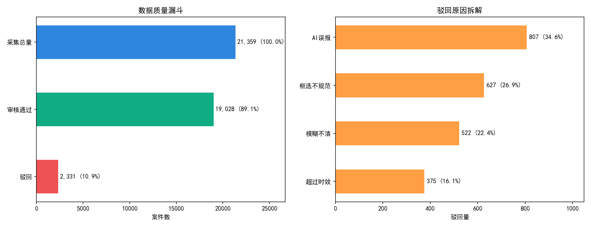
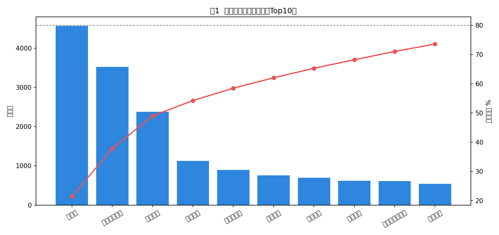
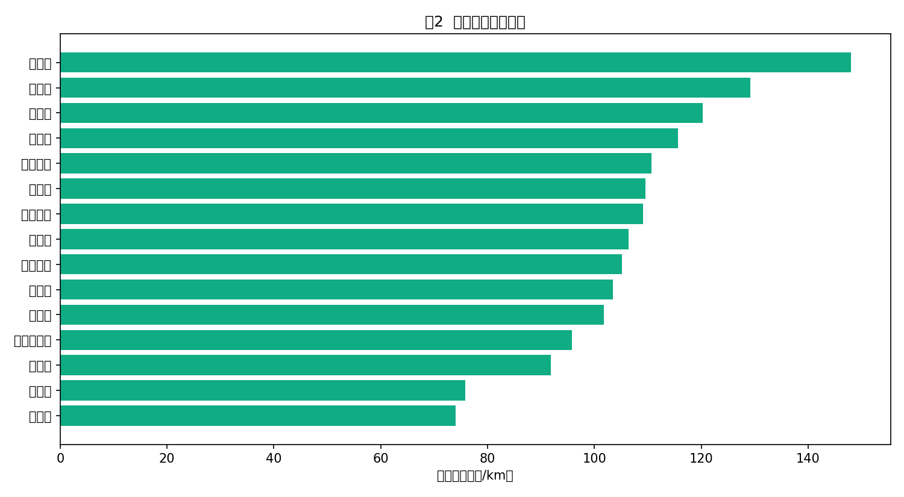
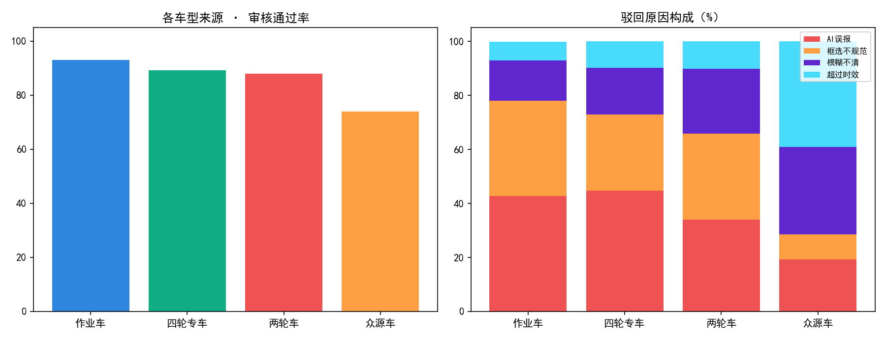
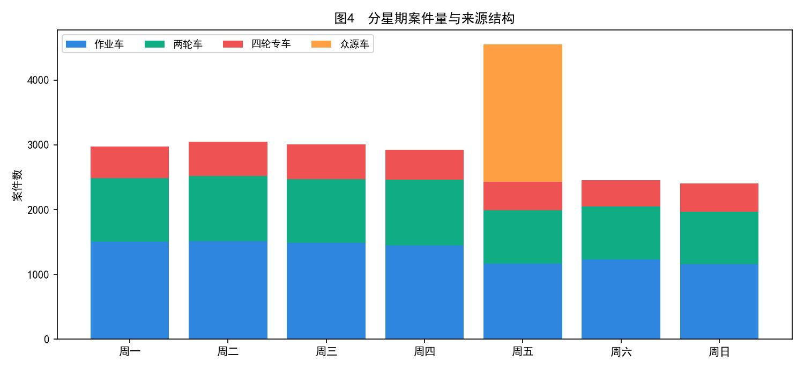

# 道路巡查数据质量与病害分布分析报告

> **汇报对象**：业务部门 / 管理层
> **分析周期**：2026-08-03 ~ 2026-09-03
> **数据量**：21,359 条案件明细
> **分析工具**：Python + SQL + Power BI

---

## 一、分析背景与目标

### 业务背景

某市道路巡查管养平台通过作业车、两轮车、四轮专车、众源车四类渠道采集道路影像，经 AI 识别 + 人工审核后派单给养护单位处置。

### 存在的问题

1. 平台仅用「案件总量」评估病害严重程度，短里程道路的真实破损被掩盖
2. 众源车渠道数据质量差、审核时滞长，产生大量无效工单
3. 周五数据洪峰与低质量叠加，审核人力排产不合理

### 分析目标

回答四个核心问题：
- 哪类病害最该优先治理？
- 哪些道路真正最严重？
- 四类渠道的数据质量差异多大？
- 一周内的审核压力峰值在哪里？

---

## 二、数据质量核验

对 21,359 条案件进行四维质检：

| 质检维度 | 驳回原因 | 驳回量 | 占比 |
|---|---|---|---|
| 准确性 | AI误报 | 944 | 40.5% |
| 时效性 | 超过时效 | 566 | 24.3% |
| 完整性 | 模糊不清 | 540 | 23.2% |
| 规范性 | 框选不规范 | 281 | 12.1% |

**总体审核通过率 89.1%（19,028 / 21,359）**

> 含义：每100条采集数据中，约11条因质量问题被驳回。通过率每下降1个百分点，约214条无效数据流入派单环节。

---

## 三、分析发现

### 发现0：数据质量漏斗——10.9%案件在审核环节流失

| 环节 | 案件量 | 转化率 |
|---|---|---|
| 采集总量 | 21,359 | 100% |
| 审核通过 | 19,028 | **89.1%** |
| 驳回 | 2,331 | 10.9% |

驳回原因拆解：

| 驳回原因 | 驳回量 | 占驳回比例 | 质检维度 |
|---|---|---|---|
| AI误报 | 944 | **40.5%** | 准确性 |
| 超过时效 | 566 | 24.3% | 时效性 |
| 模糊不清 | 540 | 23.2% | 完整性 |
| 框选不规范 | 281 | 12.1% | 规范性 |

> 含义：每100条采集数据中，约11条因质量问题被驳回。AI误报是最大流失原因（占驳回四成），说明上游AI识别模型需要优化；超过时效排第二，说明审核流转效率有提升空间。

---

### 发现1：病害类型呈长尾分布，人行道是第一大问题域

| 病害小类 | 案件数 | 占比 | 累计占比 |
|---|---|---|---|
| 路框差 | 4,567 | 21.4% | 21.4% |
| 人行道井框差 | 3,519 | 16.5% | 37.9% |
| 横向裂缝 | 2,381 | 11.1% | 49.0% |

- 人行道大类合计 9,894 件，占总量 **46.3%**
- Top3 病害累计占比 49.0%，呈长尾分布
- 路框差 + 井框差合计 8,086 件（37.9%），多为框体沉陷、高差超标，直接关联行人安全

**建议**：将路框差/井框差整治设为专项治理，按批量换框替代个案派单。

---

### 发现2：案件总量排行存在口径陷阱

| 排序视角 | 第1名 | 说明 |
|---|---|---|
| 案件总量 | 龙岗大道 3,610件 | 平台默认口径 |
| 案件密度(件/km) | **沙荷路 148.0件/km** | 本报告口径 |

- 龙岗大道总里程 32.6km，总量高部分由里程规模贡献
- 沙荷路密度比龙岗大道高 **34%**，真实病害强度被总量口径掩盖
- 若按总量排序派养护队，资源会持续向长里程主干道倾斜，短里程次干道的实际破损被忽视

**建议**：平台排行增加「案件密度(件/km)」切换口径，密度 ≥120 件/km 的道路纳入优先养护清单。

---

### 发现3：众源车渠道是双重风险

| 渠道 | 案件量 | 通过率 | 平均时滞 | 主要驳回原因 |
|---|---|---|---|---|
| 作业车 | 9,505 | **93.1%** | 0天 | AI误报(42.8%) |
| 四轮专车 | 3,283 | 89.2% | 1.5天 | AI误报(44.8%) |
| 两轮车 | 6,451 | 88.0% | 0.5天 | 模糊不清(24.0%) |
| 众源车 | 2,120 | **74.0%** | **8.0天** | 超过时效(39.0%) |

- 众源车 54.2% 的案件审核超过 7 天
- 影像拍到的坑槽、垃圾一周后可能已消失，此时再派单会产生**无效工单**
- 众源车的价值在于低成本广覆盖（周五跑全域），不应取消，应压缩流转时长

**建议**：众源数据执行 T+3 审核 SLA，超时自动作废，预估消灭 39% 时效驳回。

---

### 发现4：周五是审核压力峰值

| 时段 | 日均案件量 | 说明 |
|---|---|---|
| 周一至周四 | ~3,000件 | 结构稳定 |
| **周五** | **~4,550件** | **+52%**，众源车跑全域 |
| 周末 | ~2,450件 | 仅作业车+两轮车 |

- 周五数据洪峰与最差渠道质量（众源 74% 通过率）叠加
- 每周五是一周中审核压力最大、单位审核产出最低的时段

**建议**：审核排产向周五倾斜，启用快审模式（重点校验时效与清晰度）。

---

## 四、业务建议汇总

| # | 建议 | 预期收益 |
|---|---|---|
| 1 | 路框差/井框差专项批量治理 | 降低单件养护成本 |
| 2 | 平台排行增加「案件密度(件/km)」口径 | 养护资源精准投放 |
| 3 | 众源数据执行 T+3 审核 SLA，超时自动作废 | 消灭 39% 时效驳回 |
| 4 | 周五审核人力倾斜 + 快审模式 | 消解案件积压 |
| 5 | 两轮车采集增加防抖补光规范 | 渠道通过率 +3~5pct |

---

## 五、局限性

1. 数据为脱敏模拟，结论方向可靠、数值仅供演示
2. 缺少「派单→处置→复核」闭环数据，无法计算处置完成率
3. 案件密度未按车道、车流量加权修正

---

*报告完*
